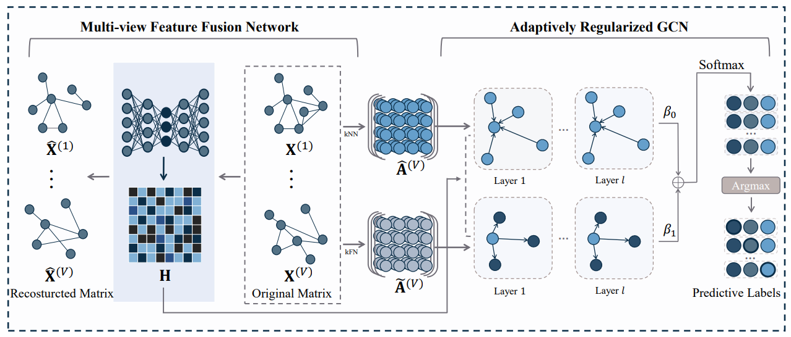

# Joint Learning of Feature and Topology for Multi-view Graph Convolutional Network 

**Yuhong Chen,** Zhihao Wu, Zhaoliang Chen, Mianxiong Dong and Shiping Wang. Joint Learning of Feature and Topology for Multi-view Graph Convolutional Network. ***Neural Networks\***.

## Method framework



We design a multi-view autoencoder to approximate matrix decomposition, which integrates the consistency of multi-view data. Simultaneously, the k-Nearest Neighbor (kNN) and k-Farthest Neighbor (kFN) strategies are utilized to calculate a more accurate set of topology matrices from two perspectives. Then JFGCN dynamically adjust it by using a flexible graph convolution to learn a robust connective pattern.

## Requirements

* Python 3.9
* Pytorch 1.12.1

##  Usage

```python train.py```

## Reference

```
@article{chen2023joint,
  title={Joint learning of feature and topology for multi-view graph convolutional network},
  author={Chen, Yuhong and Wu, Zhihao and Chen, Zhaoliang and Dong, Mianxiong and Wang, Shiping},
  journal={Neural Networks},
  volume={168},
  pages={161--170},
  year={2023}
}
```

